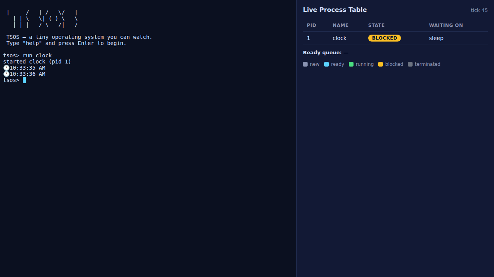

# TSOS 🖥️

[](https://github.com/makarkul/tsos/actions/workflows/ci.yml)

**A tiny operating system you can _watch_ — built with TypeScript.**

TSOS is a working operating-system simulator that runs in your web browser. It
has a real terminal, a filesystem, programs, a scheduler, and a small **kernel**
that runs everything. The cool part: a **live dashboard** shows what the OS is
doing on the inside — you watch processes start, run, wait, and finish in real
time.

TSOS is also a way to **learn how operating systems work, using TypeScript as the
language.** You don't read about schedulers and syscalls — you build them. And
you pick up real TypeScript along the way, not from a lecture, but by making
things that actually run.



---

## Quick start (5 minutes)

You need [Node.js](https://nodejs.org) installed (the "LTS" version is perfect).

```bash
npm install     # download the tools TSOS needs (do this once)
npm run dev     # start TSOS — it opens in your browser
```

Your browser opens to TSOS. Try typing these, pressing Enter after each:

```
help
run clock
run guess
run cowsay hello world
ls
cat readme.txt
ps
```

When you change a file and save it, the page **reloads by itself** — so you see
your change instantly. That fast loop is the whole point. ✨

> Stuck on setup? See **[CONTRIBUTING.md](CONTRIBUTING.md)** for step-by-step help.

---

## Your learning pathway

You don't start in the deep end — you build up to the kernel. Each phase teaches
the next, in both OS concepts and TypeScript. **The kernel isn't off-limits; it's
the destination.**

### Phase 1 — Commands (start here)

Add small shell commands in `src/shell/commands/` (a `joke`, a `roll`, an `add`).
You type them straight into the terminal.
**You learn:** the basics — variables, strings, functions, types, and the
edit → save → see-it loop. Your first real contribution.

### Phase 2 — Programs

Write programs in `src/programs/` that run as real **processes** (a countdown, a
quiz, a game). Type `run yourprogram` and watch it appear in the dashboard.
**You learn:** generators and `yield`, loops, reading input, arrays — and you
start to *see* process states (Ready, Running, Blocked) change as your code runs.

### Phase 3 — Kernel features

Now you understand processes from the outside, so you go **inside the engine**
(`src/kernel/`). Add a new syscall, change how the scheduler picks who runs next,
or build **preemption** so the OS can interrupt a program.
**You learn:** how an operating system actually works — and more advanced
TypeScript (discriminated unions, exhaustive `switch`, the `never` type) that the
engine uses to keep itself correct.

The kernel is heavily commented exactly so you can grow into it. When you get
there, work with your mentor — these are the most exciting changes in the project.

👉 **New here? Open [docs/FIRST_TASKS.md](docs/FIRST_TASKS.md), grab a Phase 1
task, and go.** The full ladder is in [docs/CURRICULUM.md](docs/CURRICULUM.md).

---

## How TSOS is organized

```
src/
  shell/
    commands/  ← Phase 1: one file per command
  programs/    ← Phase 2: one file per program
  kernel/      ← Phase 3: the engine (scheduler, processes, syscalls, filesystem)
  ui/          ← the terminal + dashboard on screen
```

- **`commands/`** and **`programs/`** hold small, self-contained files. In these
  phases you add a new file (copy a `_template.ts`), so you can work alongside
  teammates without collisions.
- **`kernel/`** is the engine. It's heavily commented and built to be read and
  changed — that's Phase 3, where the real OS learning happens.

There's a guided tour of how it all fits together in
**[docs/EMULATOR.md](docs/EMULATOR.md)**.

---

## The docs

| Doc                                            | What's in it                                                      |
| ---------------------------------------------- | ---------------------------------------------------------------- |
| **[CONTRIBUTING.md](CONTRIBUTING.md)**         | How to set up, how to work without collisions, sharing work (git) |
| **[docs/FIRST_TASKS.md](docs/FIRST_TASKS.md)** | A menu of tasks, easiest first. **Start here.**                  |
| **[docs/CURRICULUM.md](docs/CURRICULUM.md)**   | The learning ladder: the OS + TypeScript you pick up at each step  |
| **[docs/EMULATOR.md](docs/EMULATOR.md)**       | How the OS actually works (the fun internals)                     |
| **[docs/FOR_MENTORS.md](docs/FOR_MENTORS.md)** | For mentors/teachers: how to run this with a group               |

---

## What this is (and isn't)

TSOS **simulates** an operating system to make its hidden parts _visible_. It is
**not** a real OS that boots bare hardware — TypeScript runs inside the browser,
on top of a lot of software already. And that's on purpose: the goal is to **see
and build** how an OS thinks (how it picks what runs next, how a program waits for
input), not to replace Windows. 🙂

---

_Built with TypeScript, Vite, and xterm.js. Have fun tinkering._
